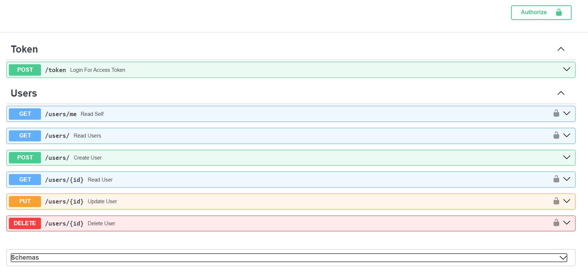

# FastAPI CRUD Application with JWT Auth

This project demonstrates the creation of a CRUD application using FastAPI wiht JWT-based authentication. It's built with Python using FastAPI and Async SQLAlchemy, with SQLite database. The application is containerized using Docker.

## Features
- JWT-based authentication
- CRUD operations for users
- Password hashing with bcrypt
- Token expiration handling
- Asyc SQLAlchemy for database operations
- SQLite as database
- Containerized with Docker
- Easy-to-use Swagger UI for API documentation and testing

## Technologies Used
- Language: Python
- Framework: FastAPI
- ORM: Async SQLAlchemy
- Authentication: JWT
- Containerization: Docker

## Installation
### Prerequisites
- Python 3.10+
- Docker (optional, for containerization)

## Setup
1. Clone the repository:
```bash
git clone https://github.com/rberaki/fastapiauth.git
cd fastapiauth
```
2. Create a virtual environment:
```bash
python3 -m venv venv
source venv/bin/activate
```
3. Install dependencies:
```bash
pip install -r requirements.txt
```
4. Run the application:
```bash
python main.py
```
5. Access the Swagger UI:
Open your browser and navigate to `http://localhost:8080/docs` to access the Swagger UI for the API.



## Docker Setup
1. Build the Docker image:
```bash
docker build -t my-fastapi-app .
```
2. Run the Docker container:
```bash
docker run -d --name my-fastapi-container -p 8080:8080 my-fastapi-app
```
3. Access the Swagger UI:
Open your browser and navigate to `http://localhost:8080/docs` to access the Swagger UI for the API.
